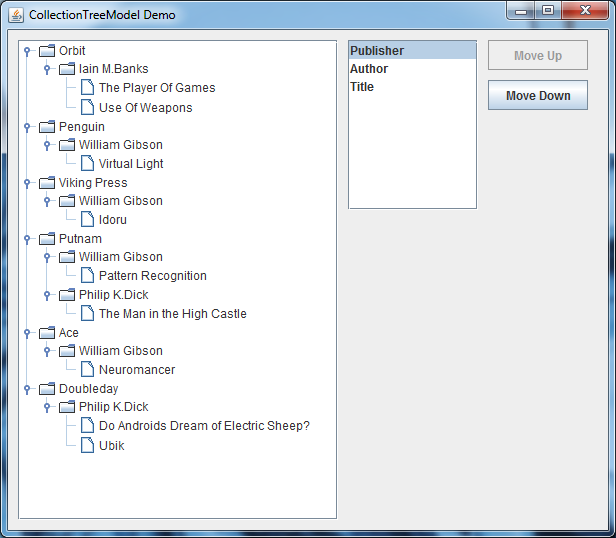

# CollectionTreeModel


*CollectionTreeModel* is a Java Swing utility for the quick and easy creation of immutable
TreeModels from Collections.
<br>
<br>
<br>
<br>

## Background
It is rarely the case that the data objects that you wish to present in a `JTree` enjoy the natural parent child relationship usually seen in examples of roll your own `TreeModel`. It is typically `File` or `Container` data objects being represented which lend themselves beautifully when implementing the `TreeModel` interface; these objects having an intrinsic parent/child relationship.

In reality this is often not the case; the desired hiearchy is often a construct we wish to impose on some existing data.
For example imagine we have the results of a database book search in a `Collection<Book>`. Our `Book` object has accessors for publisher, author, title and we'd like to display this Collection in a `JTree` ordered as so:

    + publisher
       + author
          + title

Also *ideally* it would be extremely cool to be able to change the hierarchy according to the users preferences at runtime.

##Using CollectionTreeModel
Given the following `Book` Object and `Collection<Book>`:
```
class Book {
    String publisher;
    String author;
    String title;

    Book(String publisher, String author, String title) { ... }

    String getPublisher() { return publisher; }
    String getAuthor() { return author; }
    String getTitle() { return title; }
}

Collection<Book> bookResults;
```

####Define a `Hierarchy` for the Book Object

    Hierarchy<Book> bookHierarchy = new Hierarchy<>();
    bookHierarchy.addNode(b -> b.getPublisher());
    bookHierarchy.addNode(b -> b.getAuthor());
    bookHierarchy.addNode(b -> b.getTitle());

The nodes are data providers which specify how to obtain the user objects for each `ImmutableTreeNode`.
The order in which the nodes are added to the `Hierarchy` determines the ordering.

####Construct `CollectionTreeModel<Book>`

    CollectionTreeModel<Book> bookTreeModel = new CollectionTreeModel<>(books, bookHierarchy);
    JTree jTree = new JTree(bookTreeModel);

####That's It.

Alternatively we can combine the two steps and just use the `CollectionTreeModel.Builder`:

    CollectionTreeModel<Book> bookTreeModel = CollectionTreeModel.Builder<>(books)
         .addNode(b -> b.publisher)
         .addNode(b -> b.author)
         .addNode(b -> b.title)
         .build();

### Changing the Hierarchy and Node Naming

What if the user decides they would like to re-arrange the hierarchy as `Author, Publisher, Title` ?

    + author
       + publisher
          + title

No problem, simply swap nodes around in the hierarchy and rebuild the model.

	bookHiearchy.swapNodes("Node1", "Node2");
	bookTreeModel.rebuild();

Or if we used the `Builder` approach and don't have direct access to the `Hierarchy`:

	bookTreeModel.getHiearchy().swapNodes("Node1", "Node2");
	bookTreeModel.rebuild();


`Node1` and `Node2` are default ids assigned when
the user does not explicitly specify an id for the node. To assign more meaningful
id see the next section.

### Naming Nodes

As seen in the previous section, when changing node
ordering it is useful to assign meaningful names to
the nodes. To do this add a second node id argument when
defining the hierarchy:

    Hierarchy<Book> bookHierarchy = new Hierarchy<>();
    bookHierarchy.addNode(b -> b.getPublisher(), "publisherNode");
    bookHierarchy.addNode(b -> b.getAuthor(), "authorNode");
    bookHierarchy.addNode(b -> b.getTitle());

	bookHierarchy.swapNodes("publisherNode", "authorNode");

We've used a String here for the id but it can be any Object as long as it is unique as determined by `Object.equals`. If a duplicate id is added an `IllegalArgumentException` will be thrown.

### Useful Hierarchy API methods

    ImmutableList<Object> ids = bookHierarchy.getNodeIds(); // Get the ids

    bookHierarchy.swap(0, 1); // swaps nodes by index, not name

    int i = bookHiearchy.indexOf("authorNode"); // Returns 1 from the previous example

## Importing CollectionTreeModel
To use `CollectionTreeModel` in your projects, download and place the latest [release](../../releases/latest) jar then:
```
import uk.polletto.swing.collectionTreeModel.CollectionTreeModel;
import uk.polletto.swing.collectionTreeModel.Hierarchy;
```

## See the Swing Demo

To run the demo you need **Java 8** installed. You can download from [here] (https://www.java.com/en/download/).

- Download [collectionTreeModel-demo.zip](collectionTreeModel-demo.zip?raw=true)
- Unzip it
- Launch `start_demo.bat` on Windows or `start_demo.sh` on Linux.



